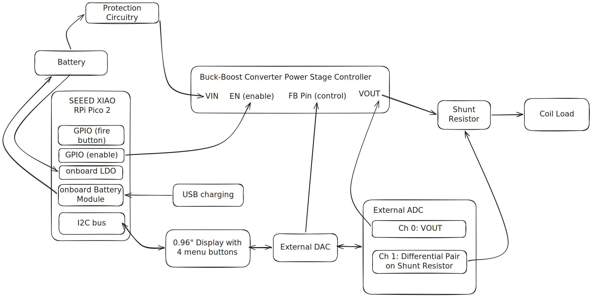

# Helix 
A device for the consumption of alternative products with Nicotine.

:::info 

**Author**: Soare Cătălin-Ștefan \
**GitHub Project Link**: https://github.com/UPB-PMRust-Students/project-stevensun369
:::

<!-- do not delete the \ after your name -->

## Description

The basic functioning principle of an E-Cigarette is pretty simple: a power source connected to a resistor. Inside of the coiled resistor, there's an absorbant material, that is irrigated by "vape juice" (Propylene Glycol and Vegetal Glycerin) which may or may not contain Nicotine. 

Yet, modern vaping devices (and Helix by extension) are not as simple. Helix can deliver up to 60W to the heating element from a single 18650 high-draw cell. The device is controllable both in Voltage mode and in Wattage mode, has automatic coil resistance detection and has a "back-up" charging functionality (at 500mA with the onboard battery management module inside of a Seeed Studio XIAO). The device is safe to operate in all conditions, with Low-Voltage Lockout, Reverse Polarity detection, Over-Current protection, Battery Cut-off while charging, and most importantly, Temperature Control. 

Temperature Control is based on the Temperature Coefficient of Resistance. The most widely-used materials for building vape coils (Stainless Steel, Nickel and Titanium) predictibly change their resistance as the coil gets hotter. Therefore with a PID loop, you can keep the device at a steady temperature, ensuring a smooth, predictable experience. Temperature Control also allows Dry Puff Protection - when the coil gets way too hot in too narrow of an interval (due to dryness in the cotton used in the tank atomizer), the system can disable the power circuitry, and notify the user to fill the tank with E-juice again.

## Motivation

After being a long time smoker and as an attempt to better myself, I have switched to alternative products for the consumption of nicotine. I had noticed a lack of well-built, feature-packed, yet accessible options on the market, and took upon the challenge to design a product that fulfilled my needs.

## Architecture 

## Log

<!-- write your progress here every week -->

### Week 5 - 11 May

### Week 12 - 18 May

### Week 19 - 25 May

## Hardware

The Buck-Boost Converter stage (crudely) has: 2x banks of 22uF ceramic Capacitors (for input and output), 4x N-Channel, 25V 33A MOSFETS in an H-bridge configuration and a Shielded, Powdered Iron 680nH 35A inductor. The Converter Stage is controlled by the TI LM5175 Synchronous 4-Switch Buck-Boost Controller. For the design of the Converter Circuitry, I have used the PMP20410 reference implementation board from TI, which is custom designed for use in E-Cigarettes.

The Microcontroller choice of the Seeed XIAO RP2350 is a compromise between my technical know-how of circuit design and the ability to still run debuggable code "in-production". It allows me to charge the battery while not being forced to break out the reference implementation for an SMD version of any other microcontroller. But, the RP2350 comes with a... less desirable ADC, and no onboard DAC, warranting the use of external chips, and while the idle power draw is not ideal, it is sufficient.

The external DAC (MCP4726) and external ADC (ADS1015) have mostly been chosen based on the driver support in the Rust embedded ecosystem. They are necessary for more granular precision both in measurement of the coil's resistance and for the control of the LM5175 controller. Basing the design on a single 18650 cell was the natural choice, as it's the most widely used in E-Cigarettes.

### Schematics

(none to be finalized, as of yet)

### Bill of Materials
Note for the BOM: although the Buck-Boost Stage will be on the same physical PCB as the mounted XIAO and most other components, I will consider it a different "component", as it is a more complex part with a BOM of its own.

| Device | Usage | Price |
|--------|--------|-------|
| [Seeed Studio XIAO RP2350](https://www.seeedstudio.com/Seeed-XIAO-RP2350-p-5944.html) | Microcontroller | $5 |
| TI LM5175 PWPR | 4-Switch Buck-Boost Controller | $3.56 |
| Converter Circuitry (on LCSC) | Passive Components for the Buck-Boost stage | $15/board |
| Vishay Dale 680nH 35A Inductor(not on LCSC, hand soldered) | Buck-Boost stage | [10RON / board + 29RON (shipping)](https://ro.mouser.com/ProductDetail/Vishay-Dale/IHLP5050FDERR68M01?qs=mYDR5ImWMszSpuAEojYVxQ%3D%3D) |
| Sony VTC6 18650 30A 3000mAh | Battery | 33RON / part |
| 0.96" OLED display | User Interface | 25RON |

## Software

| Library | Description | Usage |
|---------|-------------|-------|
| [embassy](https://github.com/embassy-rs/embassy) | Asynchronous HAL implementation (specifically for the RP2350 MCU) | The backbone of the project |
| [embedded-graphics](https://github.com/embedded-graphics/embedded-graphics) | 2D graphics library | Used for drawing the User Interface to the display |
| [ssd1306](https://docs.rs/ssd1306/latest/ssd1306/) | Display driver over I2C | Used for communicating with the 0.96" OLED monochrome display |
| [ads1x1x](https://docs.rs/ads1x1x/latest/ads1x1x/) | Driver for the ADS1x1x-family of ADCs | Measuring the resistance of the Load Coil |
| [mcp4728](https://docs.rs/mcp4728/latest/mcp4728/) | Driver for the MCP4726 DAC | Controlling the LM5174 FB pin |
| [pid](https://docs.rs/pid/latest/pid/) | no_std PID library | The Temperature Control feature and Dry Puff Detection |
| [libm](https://docs.rs/libm/latest/libm/) | no_std Maths library | Fast computation of floating point values in the PID loop |
| [heapless](https://docs.rs/heapless/latest/heapless/) | "static-friendly" data structures library | Formatting numbers into &str to be displayed on the display |

## Links
1. [STM Smoke](https://github.com/vasimv/StmSmoke/)
2. [Ghetto Vape III](https://github.com/juliancoy/ghettovape-III)
3. [Evolv DNA60 (E-cigarette board)](https://www.evolvapor.com/products/dna60)
