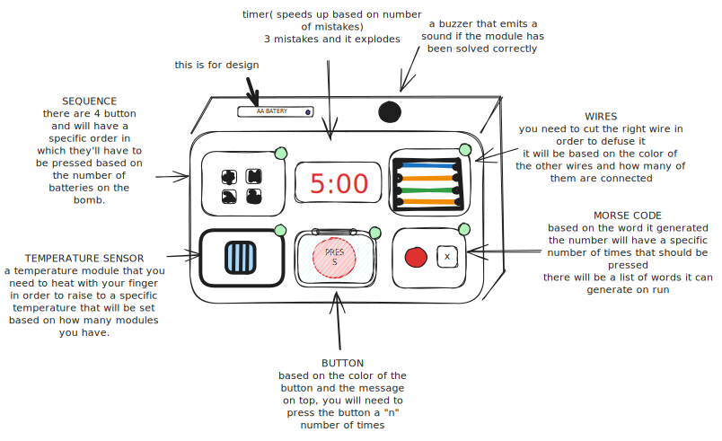
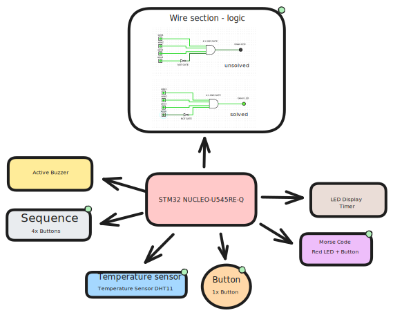

# Zhàdàn
A game about solving puzzles to defuse a bomb.

:::info 

**Author**: Druică Denisa-Adina \
**GitHub Project Link**: (https://github.com/UPB-PMRust-Students/fils-project-2026-Adinusha)

:::

<!-- do not delete the \ after your name -->

## Description

This is a game where you have to solve different puzzles, but I will refer to them as modules, in order to successfully defuse the bomb. Failing to do so will result in the "detonation" of the bomb and failing the game.

## Motivation

The motivation for this project came from my passion for gaming and technology. I wanted to blend these two in one place and create something that can be used in a fun and relaxing way.

## Architecture 






## Log

<!-- write your progress here every week -->
### Week 5 - 11 May

### Week 12 - 18 May

### Week 19 - 25 May

## Hardware

The STM32 Nucleo-U545RE-Q acts as the high-performance "brain" managing the game logic and countdown, while the TM1637 Display provides the visual timer and the DHT11 Sensor handles the interactive heat-defusal module. User inputs are captured via Square Buttons and a Green LED signals successful module completion, with an Active Buzzer providing audible strikes or explosion alerts. Finally, the SN74LS21DR AND Gate and SN74LS04N NOT Gate provide a hard-wired physical logic layer for the wire-cutting module, ensuring the circuit is only validated when the specific "correct" wire is disconnected.

### Schematics


### Bill of Materials

<!-- Fill out this table with all the hardware components that you might need.

The format is 
```
| [Device](link://to/device) | This is used ... | [price](link://to/store) |

```

-->

| Device | Usage | Price |
|--------|--------|-------|
| [STM32 NUCLEO-U545RE-Q](https://www.st.com/en/evaluation-tools/nucleo-u545re-q.html) | The microcontroller | [125 RON](https://eu.mouser.com/ProductDetail/STMicroelectronics/NUCLEO-U545RE-Q?qs=mELouGlnn3cp3Tn45zRmFA%3D%3D) |
| [SN74LS21DR](https://www.ti.com/lit/ds/symlink/sn74ls21.pdf?ts=1776868308732&ref_url=https%253A%252F%252Feu.mouser.com%252F) | 4:1 And Gate  | [2,5 RON](https://www.ti.com/lit/ds/symlink/sn74ls21.pdf?ts=1776868308732&ref_url=https%253A%252F%252Feu.mouser.com%252F) |
| [SN74LS04N](https://www.ti.com/lit/ds/symlink/sn74ls04.pdf?ts=1776871706956&ref_url=https%253A%252F%252Fen.wikipedia.org%252F) | Not Gate | [3,5 RON RON](https://eu.mouser.com/ProductDetail/595-SN74LS04N) |
| [Square Buttons]() | Buttons | [0,92 RON](https://www.optimusdigital.ro/ro/butoane-i-comutatoare/1117-buton-cu-capac-patrat-negru.html?search_query=butoane&results=154) |
| [Led Display TM1637](https://www.datasheetcafe.com/tm1637-datasheet-pdf/) | 7 segment display | [8,99 RON](https://www.optimusdigital.ro/ro/optoelectronice-afisaje-led/1202-modul-display-led-cu-interfata-seriala-chip-tm1637-.html) |
| [Temperature Sensor DHT11](https://www.mouser.com/datasheet/2/758/DHT11-Technical-Data-Sheet-Translated-Version-1143054.pdf) | For the temperature module | [4,65 RON](https://www.optimusdigital.ro/ro/senzori-senzori-de-temperatura/584-senzor-de-temperatura-dht11.html?search_query=temperature&results=84) |
| [Green LED]() | For the solved modules | [0,26 RON](https://www.optimusdigital.ro/ro/optoelectronice-led-uri/701-led-verde-de-3-mm-cu-lentile-transparente.html?search_query=led&results=647) |
| [Active Buzzer]() | For sound | [0,99 RON](https://www.optimusdigital.ro/ro/audio-buzzere/635-buzzer-activ-de-3-v.html) |


## Software

| Library | Description | Usage |
|---------|-------------|-------|
| [tm1637-embedded-hal](https://github.com/JadKHaddad/tm1637) | Display driver for the TM1637 chip | Translates game time into 7-segment LED patterns. |
| [embedded-hal](https://github.com/rust-embedded/embedded-hal) | Standard hardware interfaces for Rust. | Provides the "rules" for pin and timer interaction. |
| [dht-sensor](https://github.com/michaelbeaumont/dht-sensor) | Protocol Driver | Decodes the digital pulses from the DHT11 into temperature |
| [embassy-stm32](https://github.com/embassy-rs/embassy) | STM32-specific hardware implementation. | Controls the actual physical pins on the Nucleo U545. |
| [embassy-time](https://github.com/embassy-rs/embassy/tree/main/embassy-time) | High-precision timekeeping library for embedded systems. | Manages the 5:00 countdown and handles the variable "tick" speed based on mistakes. |
| [rand](https://github.com/rust-random/rand) | Random Selection | Picks a random word from your "Morse List" every time the game starts.|
| [heapless](https://github.com/rust-embedded/heapless) | Static Storage | Stores the list of Morse words without needing a heap |

## Links

<!-- Add a few links that inspired you and that you think you will use for your project -->

1. [Inspiration for the manual](https://www.bombmanual.com/)
2. [For a better understanding of the game](https://www.youtube.com/watch?v=BYunaBkn9Ng)

