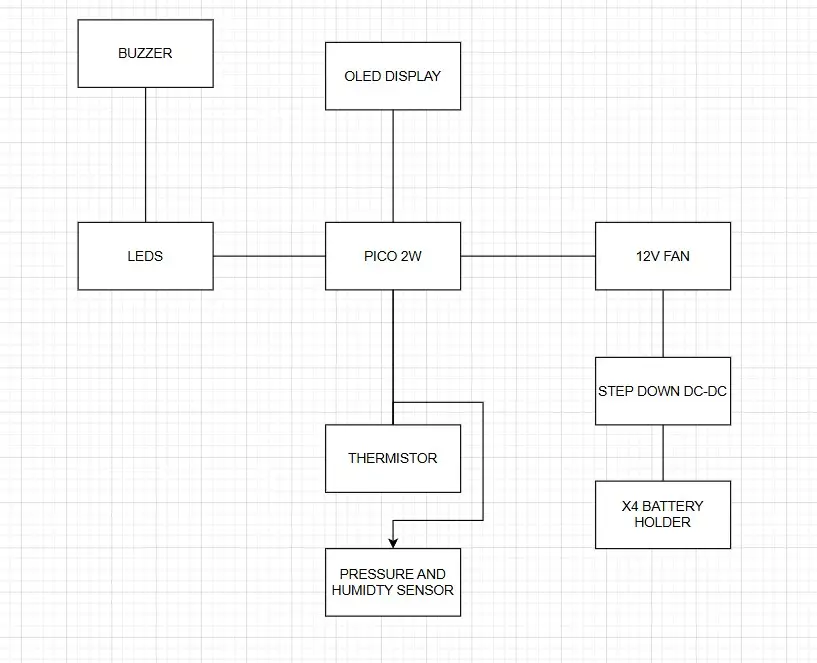

# A smart automated environment adjustment system
A smart automated environment adjustment system

:::info 

**Author**: Khalifa Tawfek \
**GitHub Project Link**: [link_to_github](https://github.com/UPB-PMRust-Students/fils-project-2026-KhalifaTawfek)

:::

## Description

This project is a smart automated environment adjustment system, It monitors room conditions such as temperature humidty and presure, it displays those monitured data on an oled display screen. When the tempreature exceeds a certain defined threshold, the system automatically triggers a 12V cooling fan to regulrate the environment, also if the tempreature becomes too high a buzzer and led lights start flashing warnings.

## Motivation

I chose this project to create an automated system that guarantees a safe and comfortable living space. By constantly monitroing the environment and automatically reacting to changes, it completetly removes the need for manual temperature adjustments. Whethere it is automatically turning on a fan to keep perferct cool space, or an alarm to prevent dangerous overheating, the goal is to have a safe space without human interaction.

## Architecture 

## Log

### Week 5 - 11 May

### Week 12 - 18 May

### Week 19 - 25 May

## Hardware

### Schematics

### Bill of Materials

| Device | Usage | Price |
|--------|--------|-------|
| [Raspberry Pi Pico 2W (x2)](https://www.optimusdigital.ro/en/raspberry-pi-boards/13327-raspberry-pi-pico-2-w.html) | The microcontrollers used for sensing, logic, and display control | 35 RON each |
| [Waterproof 10k NTC Thermistor](https://www.optimusdigital.ro/en/temperature-sensors/8204-waterproof-10k-ntc-thermistor-with-1-m-cable.html) | Primary analog temperature sensing | 8 RON |
| [BME280 Barometric Pressure Sensor](https://www.optimusdigital.ro/en/pressure-sensors/5649-bme280-barometric-pressure-sensor-module.html) | Digital sensing for pressure and humidity | 15 RON |
| [1.44" TFT LCD Display (ST7735)](https://www.optimusdigital.ro/en/lcds/3552-modul-lcd-de-144-cu-spi-i-controller-st7735-128x128-px.html) | Displaying live sensor data and system status | 19 RON |
| [CMP-FAN23 12 V Fan](https://www.optimusdigital.ro/en/others/7966-cmp-fan23-12-v-80x80x25-mm-fan-with-sensor.html) | Cooling actuator triggered by high temperatures | 15 RON |
| [4 x 18650 Battery Holder](https://www.optimusdigital.ro/en/battery-holders/991-4x18650-battery-holder.html) | Supplying portable power | 10 RON |
| Active Buzzer | Audio alarm for critical temperature warnings | 5 RON |
| [LM2596 Step-Down DC-DC Power Supply Module](https://www.optimusdigital.ro/en/5-v-step-down-power-supplies/13597-lm2596-step-down-dc-dc-power-supply-module-fixed-5v-output.html) | Stepping down the 14.8V battery output to a safe 5V | 8 RON |
| [IRFZ44N N-Channel MOSFET](https://www.optimusdigital.ro/en/transistors/7466-transistor-irfz44n.html) | Safe electronic switching for the 12V fan | 3 RON |
| 5mm LEDs & 330Ω Resistors | Visual alarm for critical temperature warnings | 2 RON |

## Software

| Library | Description | Usage |
|---------|-------------|-------|
| [embassy-rp](https://crates.io/crates/embassy-rp) | Hardware Abstraction Layer (HAL) for RP2040 microcontrollers | Used to interface with GPIO, I2C, SPI, and peripherals like pins |
| [embassy-executor](https://crates.io/crates/embassy-executor) | Lightweight asynchronous task executor tailored for embedded systems | manage async tasks |
| [embassy-embedded-hal](https://crates.io/crates/embassy-embedded-hal) | Integration utilities for shared buses and embedded-hal trait compatibility | wrap and share I2C bus access |
| [embassy-time](https://crates.io/crates/embassy-time) | Low-overhead timing and delay management for asynchronous environments | Used for time based delays |
| [embassy-sync](https://crates.io/crates/embassy-sync) | Concurrency primitives for safe data sharing and signaling across tasks | Used to send messages between tasks using by Channels |

## Links
1. [Wireless FAN control with ESPNow](https://www.youtube.com/shorts/bl58UWYxWtc?feature=share) - Inspiration for wireless communication and automated fan triggering.