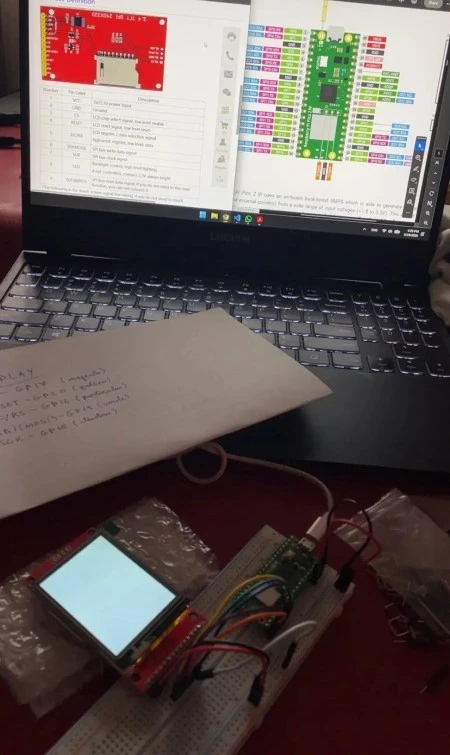

# Embedded DOOM

A DOOM clone on a microcontroller, controlled via Wi-Fi from your phone.

:::info 

**Author**: Pencea Vlad-Alexandru \
**GitHub Project Link**: https://github.com/UPB-PMRust-Students/fils-project-2026-PenceaV

:::

## Description

A clone of the iconic 1993 game DOOM built from scratch on a Raspberry Pi Pico 2W, featuring a custom raycasting engine, hand-crafted sprites, and rendering on a 2.4" ILI9341 SPI LCD display. The game is controlled via a custom Wi-Fi phone controller app, with a fallback to 6 physical push buttons for movement and action inputs. An RGB LED provides visual feedback and a buzzer generates PWM-based sound effects.

## Motivation

Growing up, DOOM was one of the first games I ever played. When I started this course and got my hands on a Raspberry Pi Pico 2W, the question that immediately came to mind was the classic one: *"But can it run DOOM?"*. I wanted to answer that myself, from scratch, building everything from the raycasting engine to the sprites, and wrap it all into something you can actually hold in your hands and play.

## Architecture

The system is composed of four main components that interact as follows:

- **Raycasting Engine**: the core game loop running on the RP2350. Each frame, it casts rays from the player's position, computes wall distances, and draws vertical slices to the display framebuffer.
- **Display Driver**: communicates with the ILI9341 LCD over SPI using the `mipidsi` crate, flushing the framebuffer each frame.
- **Input Handler**: reads either Wi-Fi UDP packets from the phone controller app or physical button GPIO states, and feeds movement/action commands into the game loop.
- **Feedback Peripherals**: the RGB LED and buzzer respond to game events (damage, shooting, etc.) via PWM signals, managed as async Embassy tasks.

    

## Log

### Week 3-4

Researched possible project ideas and went through various concepts. After deciding on the direction, I started looking into what hardware would be needed to bring it to life by researching display modules, microcontroller capabilities, input methods and audio feedback options.

### Week 6

Components arrived. Started testing each one individually verified the ILI9341 display over SPI.

### Week 8-9
Began the software implementation. Set up the Embassy async runtime on the Pico 2W, initialized the SPI display driver and got basic rendering to the ILI9341 working. Started laying out the core game loop structure and researching the raycasting algorithm in the context of embedded constraints.

## Hardware

The project is built around the **Raspberry Pi Pico 2W** (RP2350), which handles all game logic, rendering, networking, and peripheral control. The display is a 2.4" 240×320 ILI9341 LCD connected over SPI. Six push buttons provide physical input controls (forward, backward, left, right, interact and shoot). An RGB LED and a passive buzzer handle visual and audio feedback respectively, both driven by PWM signals

### Schematics

TODO

### Bill of Materials

| Device | Usage | Price |
| --- | --- | --- |
| Raspberry Pi Pico 2W | Main microcontroller (RP2350, Wi-Fi) | [55 RON](https://www.skroutz.ro/s/60683103/raspberry-pi-pico-2-w-cu-header.html) |
| 2.4" ILI9341 SPI LCD 240×320 | Game display | [55 RON](https://www.emag.ro/display-lcd-2-8-240x320-pixeli-slot-micro-sd-tactil-4-a-034/pd/DJCT01MBM/?cmpid=148774&utm_source=google&utm_medium=cpc&utm_campaign=(RO:eMAG!)_3P_NO_SALES_%3e_Jucarii_hobby&utm_content=111476631565&gad_source=1&gad_campaignid=11606684347&gbraid=0AAAAACvmxQilCf9PY0h8ELYpgN1_Y8PzM&gclid=CjwKCAjw46HPBhAMEiwASZpLRBOb-p4JUqtdobB3buTT2yohCaw7uxZaYvZ8KKeGMlCCvHK8rUjNUBoC0HEQAvD_BwE) |
| Push Button (×6) | Movement and action input | Already owned |
| RGB LED | Visual game feedback | Already owned |
| Passive Buzzer | PWM audio feedback / sound effects | Already owned |
| Breadboard + Jumper Wires | Prototyping | ~15 RON |

## Software

| Library | Description | Usage |
| --- | --- | --- |
| [embassy-rp](https://github.com/embassy-rs/embassy) | Embassy HAL for RP2350 | GPIO, SPI, PWM, async runtime |
| [embassy-executor](https://github.com/embassy-rs/embassy) | Async task executor | Running concurrent game tasks |
| [embassy-net](https://github.com/embassy-rs/embassy) | Async networking stack | Wi-Fi UDP for phone controller |
| [embassy-time](https://github.com/embassy-rs/embassy) | Async timers and delays | Frame timing, debounce |
| [cyw43](https://github.com/embassy-rs/embassy) | Wi-Fi driver for CYW43439 | Wireless communication on Pico 2W |
| [mipidsi](https://github.com/almindor/mipidsi) | Display driver for ILI9341 | SPI display rendering |
| [embedded-graphics](https://github.com/embedded-graphics/embedded-graphics) | 2D graphics primitives | Drawing walls, sprites, HUD |
| [micromath](https://github.com/tarcieri/micromath) | Fast no-std math | Fixed-point trig for raycasting |

## Links

1. [Embassy-rs](https://embassy.dev/)
2. [Raycasting tutorial - Lode's Computer Graphics](https://lodev.org/cgtutor/raycasting.html)
3. [mipidsi crate](https://github.com/almindor/mipidsi)
4. [embedded-graphics crate](https://github.com/embedded-graphics/embedded-graphics)
5. [Raspberry Pi Pico 2W datasheet](https://datasheets.raspberrypi.com/picow/pico-2-w-datasheet.pdf)
6. [ILI9341 datasheet](https://cdn-shop.adafruit.com/datasheets/ILI9341.pdf)